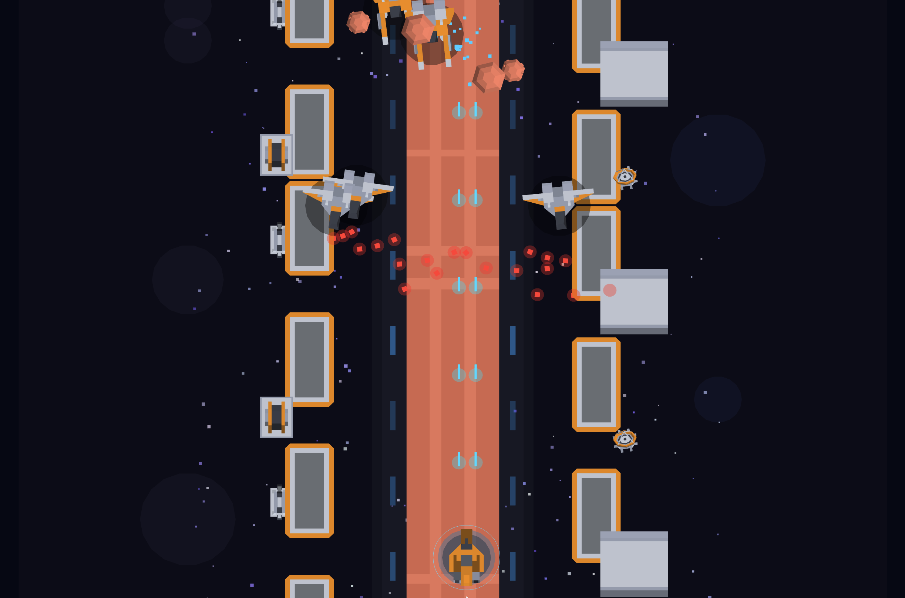

# TRAD Strike



A small Raiden Trad-inspired vertical shooter written in C99 with:

- Sokol for native and browser rendering/input.
- `../c-ecs` for gameplay entities and systems.
- Kenney Space Kit 3D models converted to static C mesh data at build time.

Play in your browser: <https://briansunter.github.io/trad/>

## Build

Use the Nix shell for the full native and browser toolchain:

```sh
nix develop
make all
```

Native only:

```sh
make native
./build/trad
```

Browser:

```sh
make web
cd dist && python3 -m http.server 8000
```

Then open `http://127.0.0.1:8000`.

## Controls

Desktop supports keyboard and mouse. Mobile uses touch on the left half for movement and the right half for firing.

## Assets

3D models come from Kenney Space Kit, licensed CC0. The original asset license is included at `assets/vendor/kenney-space-kit/License.txt`.
